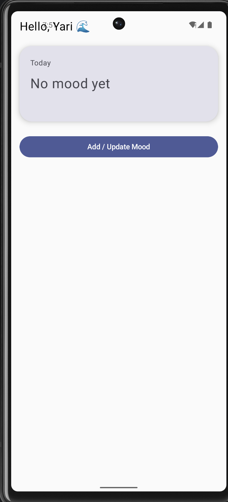
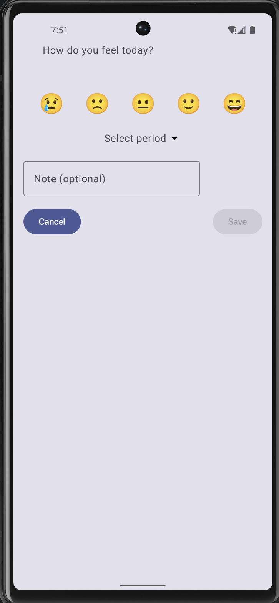

README.md

# SerenApp 🌙

> A calm space to reflect on your emotions

SerenApp is a simple mood tracking app designed with a peaceful, introspective experience in mind.  
Inspired by the moon and a soft violet-purple palette, the app encourages users to pause and reflect on how they feel throughout the day.

---

## 📱 Overview

SerenApp focuses on simplicity and intention.  
Instead of overwhelming dashboards, it highlights what matters most: **your emotional state today**.

The design aims to create a calm and reflective atmosphere through minimal UI and soft color tones.

---

## ✨ Features

- Select a mood with emoji representation 😊🌙😔
- Choose a time of day (Morning / Night)
- Add an optional personal note
- Prevent duplicate entries per day and period
- View today's mood in a simple and focused main screen

---

## 🛠 Tech Stack

- Kotlin
- Jetpack Compose
- MVVM Architecture
- StateFlow
- Hilt (Dependency Injection)
- Room (Local Database)

---

## 🧠 Architecture

The app follows the MVVM pattern:

- **UI (Compose):** Displays state and reacts to updates
- **ViewModel:** Manages UI state using StateFlow
- **Domain (UseCases):** Handles business logic
- **Data (Room):** Stores mood entries locally

---

## 🎨 Design Inspiration

The app is inspired by the **moon** and uses a **violet-purple color palette** to create a calm, introspective mood.

The goal is to provide a space that feels quiet, personal, and reflective.

---

## 📸 Screenshots

### 🌙 Home — Today’s Reflection

### ✨ Add Mood — Capture Your Moment

---

## 🚀 How to Run

1. Clone the repository
2. Open in Android Studio
3. Run the app on an emulator or physical device

---

## 🎯 Future Improvements

- Mood history timeline
- UI polish with subtle animations
- Graphics/statistics
- Hobby ideas for mental health
- Motivational phrases during the day
